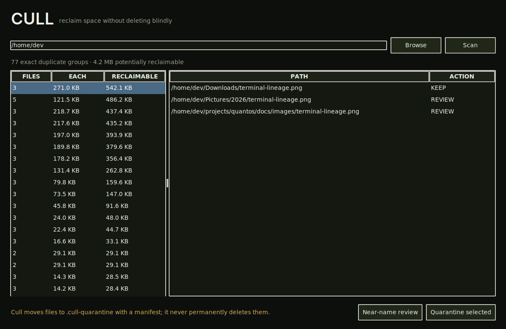

<div align="center">
  
  <h1>Cull</h1>
  <p><strong>Find duplicate files, review them safely, and reclaim space without deleting blindly.</strong></p>
  <p>
    <a href="https://github.com/purysho/Cull/actions/workflows/ci.yml"></a>
    <a href="https://github.com/purysho/Cull/releases"></a>
    <a href="LICENSE"></a>
    <a href="#download"></a>
  </p>
  <p><strong>Download:</strong> <a href="https://github.com/purysho/Cull/releases/latest/download/Cull-Windows-x64.exe">Windows</a> · <a href="https://github.com/purysho/Cull/releases/latest/download/Cull-macOS-arm64.zip">macOS</a> · <a href="https://github.com/purysho/Cull/releases/latest/download/Cull-Linux-x86_64.tar.gz">Linux</a> · <a href="#run-from-source">Run from source</a> · <a href="https://github.com/purysho/Cull/issues">Report an issue</a></p>
</div>

Cull is a local duplicate-file review tool. Exact duplicates are verified with SHA-256. Selected files are moved into a timestamped `.cull-quarantine` folder with a recovery manifest instead of being permanently deleted.



## Features
- Exact duplicate grouping using size + SHA-256
- Reclaimable-space estimates
- Name-based near-duplicate review
- Reversible quarantine workflow
- Recovery manifest for moved files
- Local-only scanning

## Safety model
Cull never deletes files permanently. Quarantine keeps the original relative path and writes `manifest.json` so moves can be reversed.

## Download

| Platform | File |
|---|---|
| Windows 10/11 (x64) | [Cull-Windows-x64.exe](https://github.com/purysho/Cull/releases/latest/download/Cull-Windows-x64.exe) — portable, no installer |
| macOS (Apple Silicon) | [Cull-macOS-arm64.zip](https://github.com/purysho/Cull/releases/latest/download/Cull-macOS-arm64.zip) — unzip and move to Applications |
| Linux (x86_64) | [Cull-Linux-x86_64.tar.gz](https://github.com/purysho/Cull/releases/latest/download/Cull-Linux-x86_64.tar.gz) — extract and run `./Cull` |

Each [release](https://github.com/purysho/Cull/releases) is built from the tagged source by GitHub Actions and carries a `SHA256SUMS.txt`. The builds are not yet code-signed, so on first launch Windows SmartScreen may ask you to confirm ("More info" → "Run anyway"), and macOS may need you to Control-click the app and choose **Open**.

**Status: beta.** Cull does what this README describes and is covered by CI on Windows, macOS and Linux, but it is young: expect rough edges, and please [report them](https://github.com/purysho/Cull/issues).

## Run from source
```powershell
pyw cull_desktop.pyw
```

## Tests
```powershell
python -m unittest discover -s tests -v
```

## Windows build
```powershell
powershell -ExecutionPolicy Bypass -File .\build-windows.ps1
```

## License
MIT
