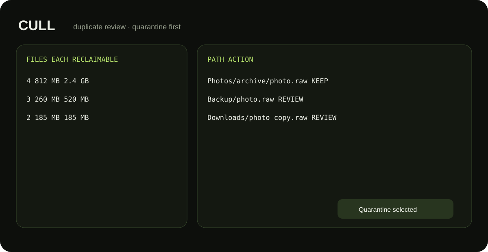

<div align="center">
  
  <h1>Cull</h1>
  <p><strong>Find duplicate files, review them safely, and reclaim space without deleting blindly.</strong></p>
  <p><a href="#run-from-source"><strong>Run from source</strong></a> · <a href="https://github.com/purysho/Cull/issues">Report an issue</a></p>
</div>

Cull is a local duplicate-file review tool. Exact duplicates are verified with SHA-256. Selected files are moved into a timestamped `.cull-quarantine` folder with a recovery manifest instead of being permanently deleted.



## Features
- Exact duplicate grouping using size + SHA-256
- Reclaimable-space estimates
- Name-based near-duplicate review
- Reversible quarantine workflow
- Recovery manifest for moved files
- Local-only scanning

## Safety model
Cull never deletes files permanently. Quarantine keeps the original relative path and writes `manifest.json` so moves can be reversed.

## Run from source
```powershell
pyw cull_desktop.pyw
```

## Tests
```powershell
python -m unittest discover -s tests -v
```

## Windows build
```powershell
powershell -ExecutionPolicy Bypass -File .\build-windows.ps1
```

## License
MIT
